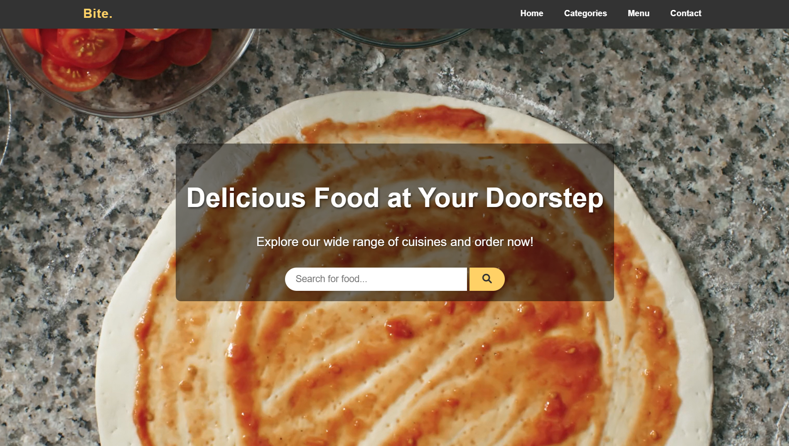

# Restaurant Management System

A modern PHP and MySQL based restaurant ordering platform with a customer-facing storefront and an admin dashboard for managing categories, menu items, administrators, and orders.

[](https://www.php.net/)
[](https://www.mysql.com/)
[](https://developer.mozilla.org/)

## Overview

This project is a full restaurant website and management panel built with Core PHP. It lets customers browse food categories, search the menu, view featured items, and place orders, while admins can manage the main business data from a dedicated dashboard.

## Screenshots

### Home Page



### Categories Page


### Category Result Page


### Food Menu Page


### Checkout Page


## Tech Stack

- PHP
- MySQL
- HTML5
- CSS3
- JavaScript
- Font Awesome
- AOS animation library


## Database Design

### Tables Used

- `tbl_admin`
- `tbl_category`
- `tbl_food`
- `tbl_order`


## Local Setup Guide

### 1. Clone the repository

```bash
git clone https://github.com/dilminekanayaka/Restaurant-Management-System.git
```

### 2. Move the project into your local server directory

For XAMPP, place it inside:

```text
htdocs/Restaurant-Management-System
```

### 3. Create the database

- Open phpMyAdmin
- Create a new database named `Restaurant-Management-System`
- Import SQL file (database/restaurant-management-system.sql)


### 4. Configure database connection

Update [config/constants.php]if needed:

```php
define('SITEURL', 'http://localhost/Restaurant-Management-System/');
define('LOCALHOST', 'localhost');
define('DB_USERNAME', 'root');
define('DB_PASSWORD', '');
define('DB_NAME', 'Restaurant-Management-System');
```

### 5. Run the project

Open in your browser:

```text
http://localhost/Restaurant-Management-System/
```

### Customer Order Flow

1. Customer opens the home page
2. Browses categories or searches for a food item
3. Opens a food item and goes to the order page
4. Enters quantity and delivery details
5. Submits the order
6. Order is saved to `tbl_order`
7. Admin updates the order status from the dashboard

### Admin Management Flow

1. Admin logs into the dashboard
2. Reviews current restaurant stats
3. Manages admins, categories, and foods
4. Reviews incoming orders
5. Updates order progress and delivery status

## Author

**Dilmin Ekanayaka**

